# Лабораторная работа №3 "НА Postgres Cluster"

# Часть 1. Поднимаем Postgres
1. Создание и поднятие docker контейнеров:
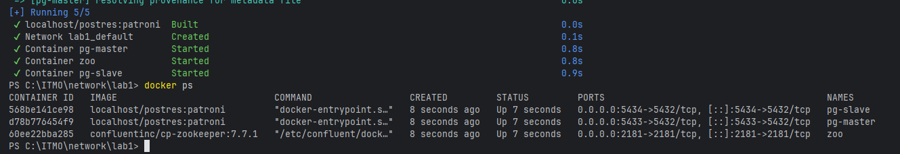
2. Определение master и slave ноды (master - pg-master, slave - pg-slave)
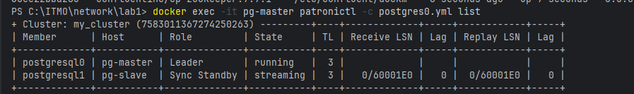
3. Проверка, что зукипер запустился
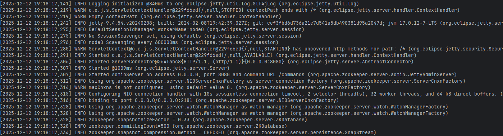

## Часть 2. Проверяем репликацию
4. Подключение к нодам постгреса

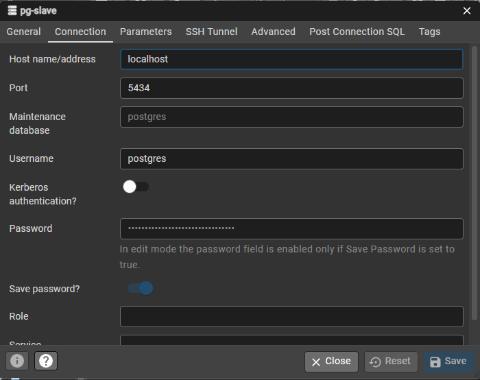

6. В ноду лидера кластера (pg-master) добавляем таблицу и вставляем в неё данные
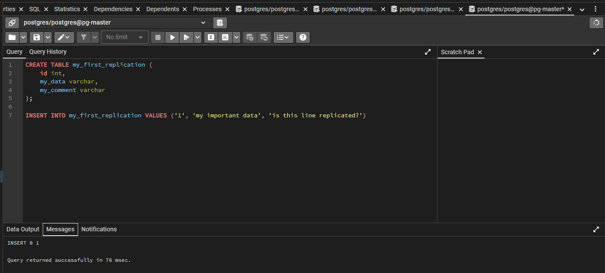

7. Проверяем, что в pg-slave также создалась эта таблица с теми же данными
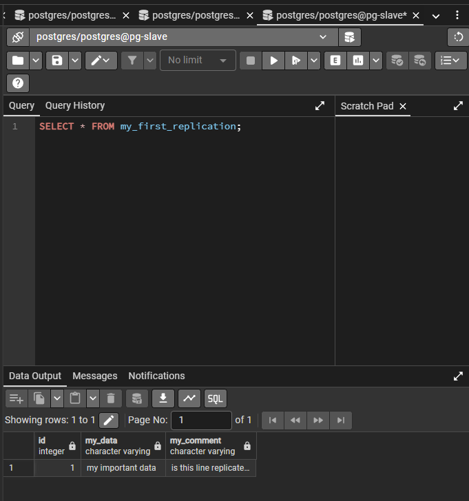

8. Неудачно пытаемся удалить строчку из таблицы подключения pg-slave
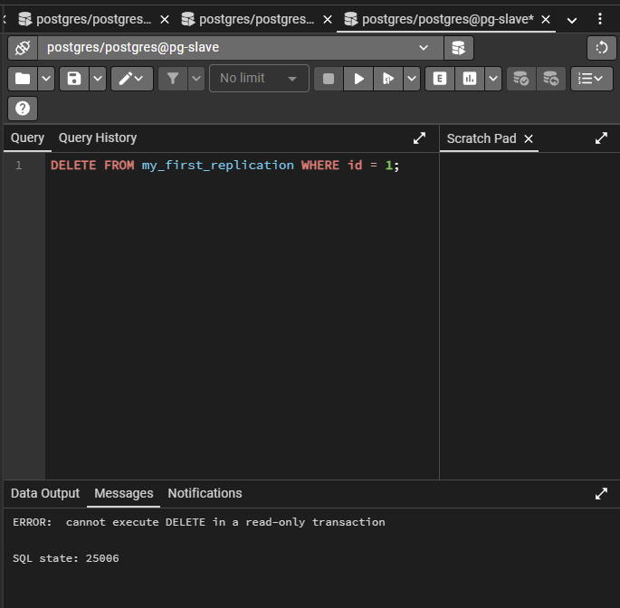

## Часть 3. Делаем высокую доступность
8. Перезапускаем docker контейнеры после добавления необходимых конфигурационных файлов и обновления docker-compose.yml для HAProxy
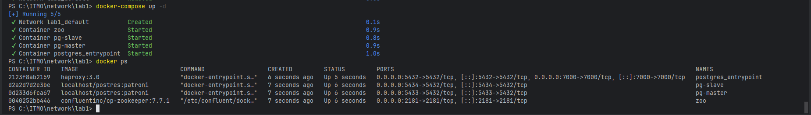
9. Проверяем перераспределение ролей (роли те же)
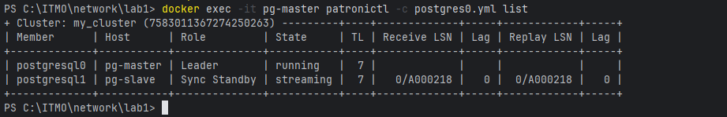
10. Проверяем зукипер
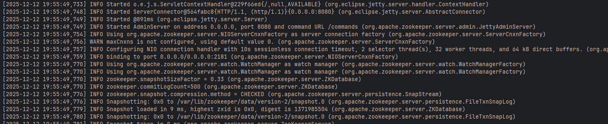
11. Создаём подключение к pg-entrypoint (haproxy)
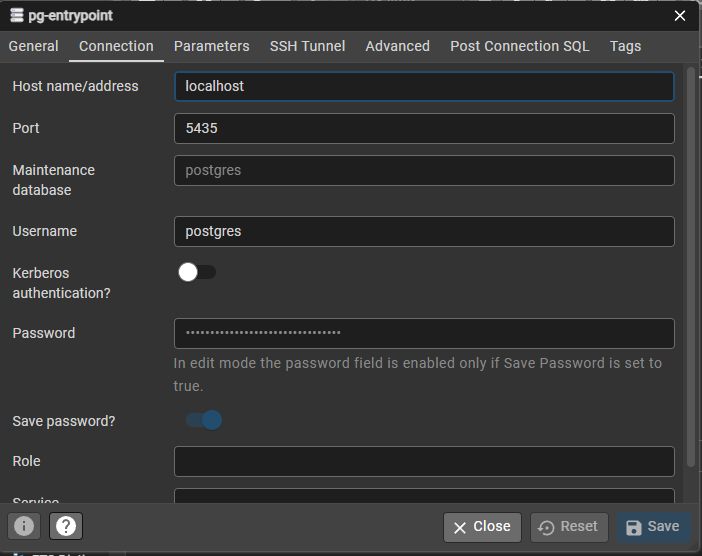
12. Пытаемся заселектить данные из мастер-ноды
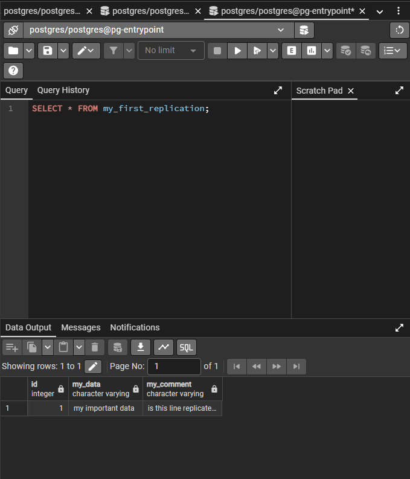

## Задание
13. Отключаю мастер-ноду командой `docker stop pg-master`
14. Наблюдаю за логами pg-slave и haproxy. В логах у pg-slave замечаю, patroni перераспределил роли, и теперь pg-slave является лидером.
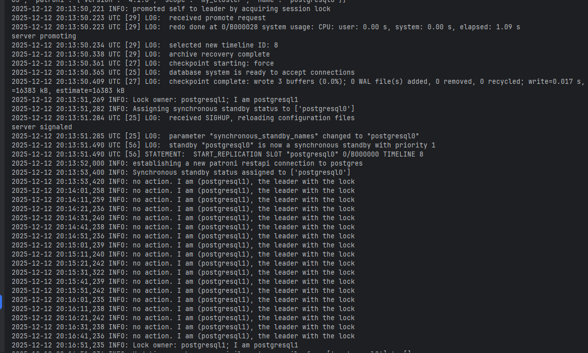
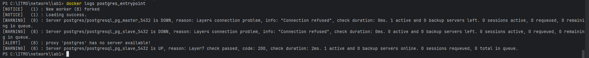
15. В entrypoint-подключение добавляю новую строчку, которая дублируется и в pg-slave

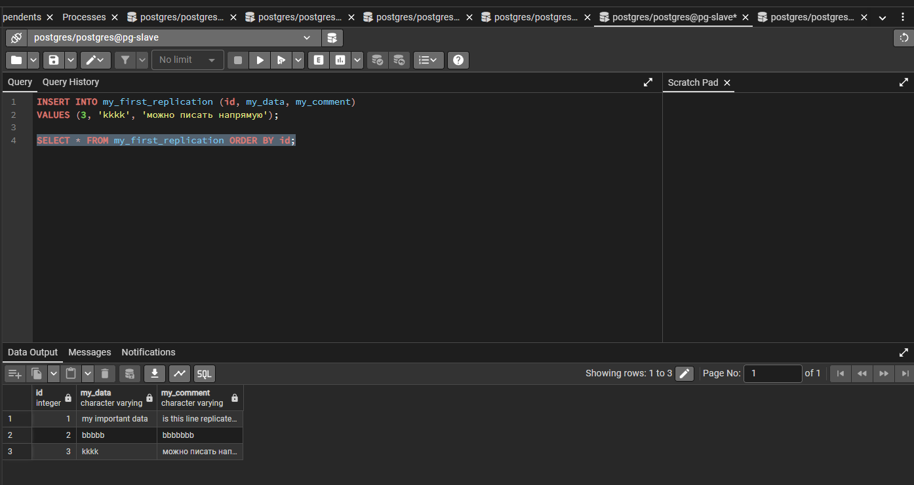
Также можно заметить, что у pg-slave пропало read-only ограничение!

## Ответы на вопросы
1. Порты 8008 и 5432 вынесены в разные директивы, expose и ports. По сути, если записать 8008 в ports, то он тоже станет exposed. В чем разница?
Порты в директивах expose доступны только в пределах сети docker compose, а в директивах ports порты будут открыты на хост-машины, и будут доступны извне.
2. При обычном перезапуске композ-проекта, будет ли сбилден заново образ? А если предварительно отредактировать файлы postgresX.yml? А если содержимое самого Dockerfile? Почему?**
Compose образы не пересобираются, если не используется флаг --build, так как изменения в конфигурации применяются сразу, а изменения в Dockerfile требуют пересборки.

