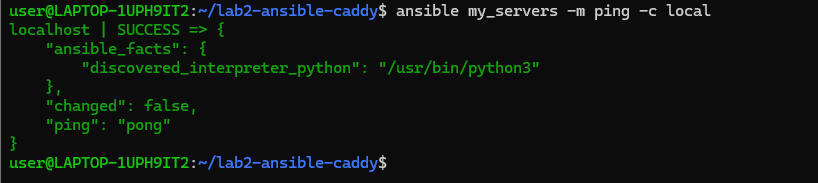
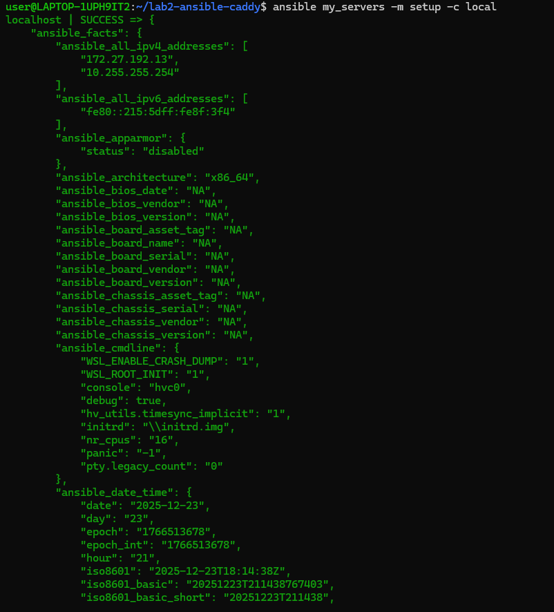
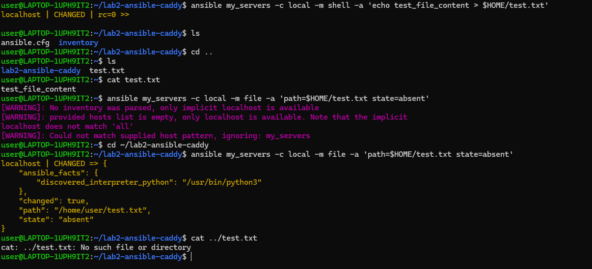
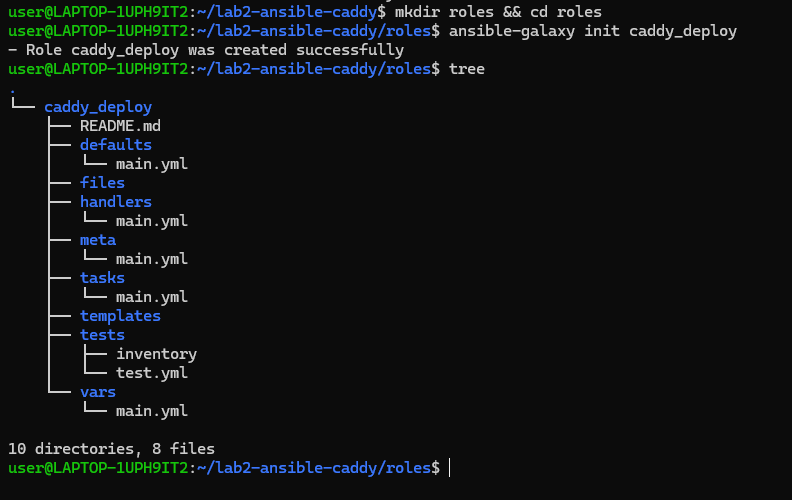
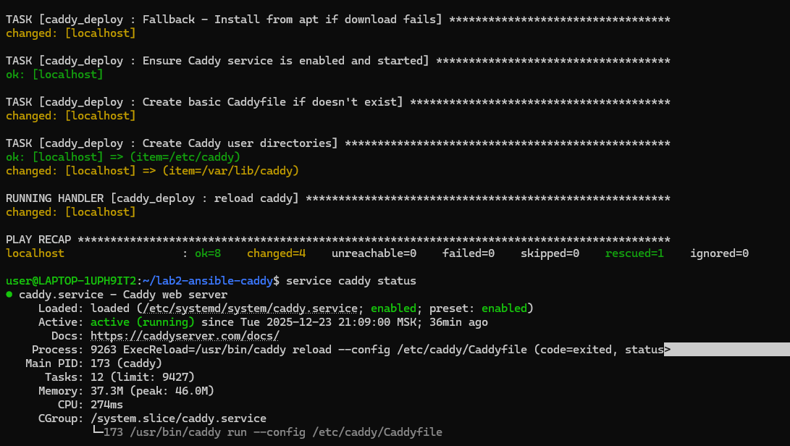
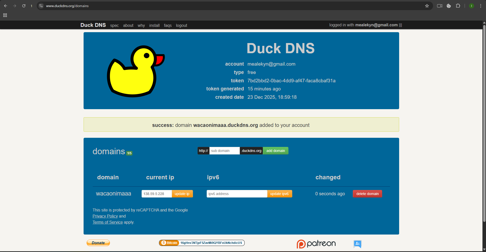
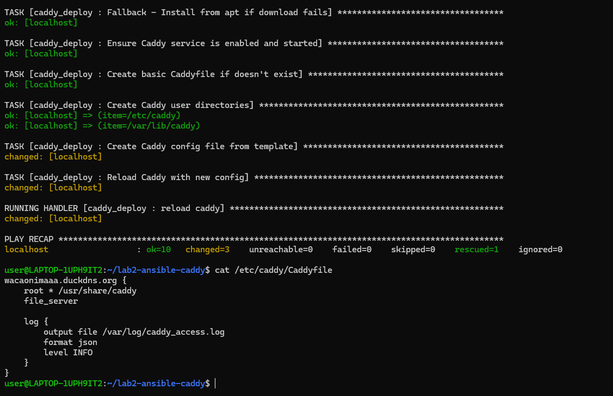
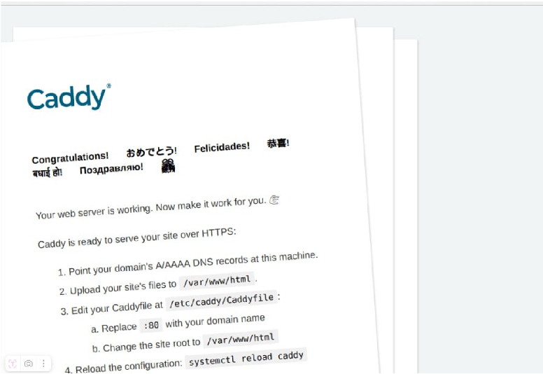
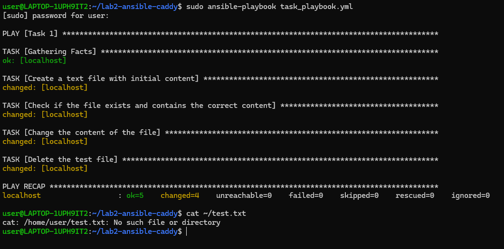

# Лабораторная работа 3 Ansible + Caddy

## Выполнение

1. Проверка, что Ansible подключился



2. Пробуем выполнить команду посложнее на нашем клиенте



3. Установка Caddy

\

4. Запускаем плейбук



5. Регистрируем бесплатный домен



6. Запускает обновленный плейбук и проверяем Caddyfile





# Задания:

1. Переписать пример с созданием и удалением файла из шага 5 Части 1 с ad-hoc команд на плейбук формат, а так же добавить четвертый шаг - перед удалением поменять содержимое файла на любое
другое.

Обновленный плейбук:

```
---

- name: Task 1
  hosts: my_servers
  connection: local
  tasks:
    - name: Create a text file with initial content
      shell: 'echo test_file_content > {{ ansible_env.HOME }}/test.txt'
      register: create_file_output

    - name: Check if the file exists and contains the correct content
      command: "cat {{ ansible_env.HOME }}/test.txt"
      register: file_content_check
      failed_when: "'test_file_content' not in file_content_check.stdout"

    - name: Change the content of the file
      shell: 'echo new_test_content > {{ ansible_env.HOME }}/test.txt'
      when: file_content_check is succeeded

    - name: Delete the test file
      file:
        path: "{{ ansible_env.HOME }}/test.txt"
        state: absent
```



2. “Расширить” конфиг вебсервера Caddy любым функционалом по желанию: например, добавить проксирование, или какие-нибудь заголовки ( header ). Вместо дефолтной страницы Caddy подставить
свою, хотя бы index.html с Hello world внутри. Добавить это в качестве дополнительного шага в tasks

Обновленный Caddyfile.j2:

```
{{ domain_name }} {
        root * /var/www/html
        file_server

        log {
                output file {{ log.file }}
                format json
                level {{ log.level }}
        }

        header / {
          X-Custom-Header "Hello from Caddy"
        }

        reverse_proxy /api/* localhost:3000
}
```

Обновленный tasks/main.yml:

```---
# tasks file for caddy_deploy

- name: Install prerequisites
  apt:
    pkg:
    - debian-keyring
    - debian-archive-keyring
    - apt-transport-https
    - curl

- name: Add key for Caddy repo
  apt_key:
    url: https://dl.cloudsmith.io/public/caddy/stable/gpg.key
    state: present
    keyring: /usr/share/keyrings/caddy-stable-archive-keyring.gpg

- name: add Caddy repo
  apt_repository:
    repo: "deb [signed-by=/usr/share/keyrings/caddy-stable-archive-keyring.gpg] https://dl.cloudsmith.io/public/caddy/stable/deb/debian any-version main"
    state: present
    filename: caddy-stable

- name: add Caddy src repo
  apt_repository:
    repo: "deb-src [signed-by=/usr/share/keyrings/caddy-stable-archive-keyring.gpg] https://dl.cloudsmith.io/public/caddy/stable/deb/debian any-version main"
    state: present
    filename: caddy-stable

- name: Install Caddy webserver
  apt:
    name: caddy
    update_cache: yes
    state: present

- name: Create config file
  template:
    src: templates/Caddyfile.j2  # Откуда берем
    dest: /etc/caddy/Caddyfile  # Куда кладем

- name: Create /var/www/html directory
  file:
    path: /var/www/html
    state: directory
    owner: www-data
    group: www-data
    mode: '0755'

- name: Create custom index.html
  copy:
    content: |
      <html>
        <head>
          <title>LR2</title>
        </head>
        <body>
          <h1>Hello World from Caddy!</h1>
        </body>
      </html>
    dest: /var/www/html/index.html
    owner: www-data
    group: www-data
    mode: '0664'

- name: Reload with new config
  service:
    name: caddy
    state: reloaded
```


